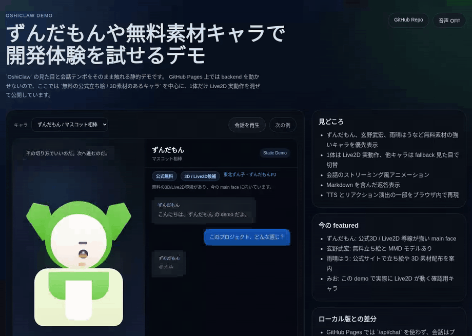

# OshiClaw

Live2D キャラとペアプロ風に会話できるローカル Web アプリです。  
FastAPI でチャット API を出し、フロントは素の HTML/CSS/JS で動きます。



短いデモ動画:

- [WEBM](./media/readme/oshiclaw-demo.webm)
- [MP4](./media/readme/oshiclaw-demo.mp4)

再配布しにくいモデルがある前提でも、README から挙動をすぐ確認できるようにしています。
GitHub Pages 側は、public では bundled sample の Live2D 実動作と、公式キャラ候補の出典リンクだけを見せる構成にしています。

## できること

- Live2D キャラ表示。モデルが使えないキャラは fallback 見た目で表示
- キャラ切替
- LLM モデル切替
- ストリーミング応答
- 生成中止、再試行、低速時の待機表示
- 会話履歴の永続化
- ブラウザ TTS と口パク風アニメ
- Markdown 表示
  - 見出し
  - 箇条書き
  - 番号付きリスト
  - 引用
  - リンク
  - code block / inline code
  - code block のコピー
- CLI モードでも会話可能

## 現在のキャラ

- `ずんだもん`
  - 既定キャラ
  - 公式無料 / 画像素材枠
- `四国めたん`
  - 公式無料 / 画像素材枠
- `九州そら`
  - 公式無料 / 画像素材枠
- `春日部つむぎ`
  - 公式無料 / 画像素材枠
- `雨晴はう`
  - 公式無料 / 画像素材枠
- `青山龍星`
  - 公式無料 / 画像素材枠
- `玄野武宏`
  - 公式無料 / 画像素材枠
- `冥鳴ひまり`
  - 公式無料 / 画像素材枠
- `みお`
  - Live2D モデルあり
- `ハル`
  - オリジナル fallback
- `黒瀬`
  - オリジナル fallback
- `ゆっくり霊夢`
  - experimental / 自作 fallback

出典と利用メモは [CHARACTERS.md](./CHARACTERS.md) にまとめています。

## 必要環境

- Python 3.10+
- モダンブラウザ
- 次のどちらか
  - OpenAI API key
  - Ollama などの OpenAI 互換ローカル endpoint

## セットアップ

```bash
python3 -m pip install -r requirements.txt
cp .env.example .env
```

`.env` は使う LLM に合わせて設定します。

### OpenAI を使う場合

```env
OPENAI_API_KEY=sk-...
# OPENAI_BASE_URL=
MODEL=gpt-4o-mini
PORT=8000
```

### Ollama を使う場合

`OPENAI_API_KEY` を設定しなければ、既定で `http://127.0.0.1:11434/v1` を使います。

```env
# OPENAI_API_KEY=ollama
OPENAI_BASE_URL=http://127.0.0.1:11434/v1
MODEL=gemma4:latest
PORT=8000
```

## 起動

### Web アプリ

```bash
python3 server.py
```

ブラウザで `http://127.0.0.1:8000` を開きます。

### CLI

```bash
python3 main.py
```

## 使い方

1. ヘッダでキャラとモデルを選ぶ
2. 右下の入力欄から質問を送る
3. 必要なら `停止` で生成や読み上げを止める
4. `音声 ON/OFF` と voice 選択で TTS を調整する

## 主な構成

```text
OshiClaw/
├── server.py          # FastAPI サーバー
├── llm.py             # OpenAI / OpenAI 互換 LLM 呼び出し
├── main.py            # CLI モード
├── context.py         # カレントディレクトリの .py 文脈読み込み
├── characters/        # キャラ定義
└── static/            # フロントエンドと Live2D アセット
```

## API のざっくり一覧

- `POST /api/chat`
- `POST /api/chat/stream`
- `POST /api/reset`
- `GET /api/characters`
- `POST /api/character`
- `GET /api/models`
- `POST /api/model`
- `GET /api/session`
- `PUT /api/session`

## 既知の制約

- 実 Live2D モデルは今のところ `みお` だけです
- 公式無料キャラの多くは、現状は `画像素材候補 + fallback 表示` として登録しています
- `ゆっくり霊夢` は experimental 枠で、外部素材は同梱していません
- 会話履歴は単一セッション前提の簡易実装です
- TTS の voice 名はブラウザ / OS ごとに変わります
- Markdown は軽量な自前実装なので table などは未対応です

## 開発メモ

- `OPENAI_API_KEY` が未設定で `OPENAI_BASE_URL` も未設定なら、ローカル Ollama に自動フォールバックします
- `MODEL` と `PORT` は環境変数で切り替えられます
- キャラ追加は `characters/*.yaml` を増やせば対応できます
- README 用デモ動画は `python3 scripts/record_demo.py` で撮り直せます
